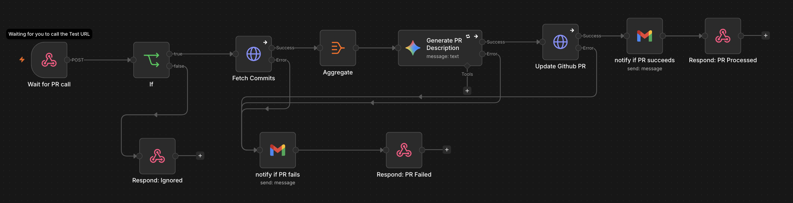
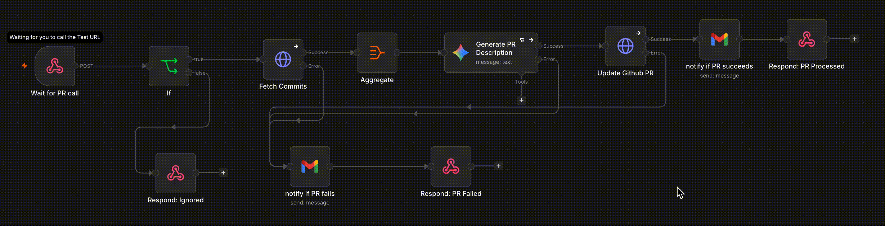

# AI-Powered PR Documentation Bot (n8n + Google Gemini API + GitHub API)

> Built an automated workflow that triggers on GitHub PR events, orchestrates REST API calls and an LLM to generate structured PR documentation, and posts it back via authenticated API — reducing manual PR-writing time to zero.

## Overview
This project is an automated n8n workflow designed to streamline the pull request documentation process. When a developer opens a PR, the workflow automatically intercepts the event, fetches the associated commit diffs using the GitHub REST API, and uses Google's Gemini API to generate a well-structured PR description based on a standard template.
The description is then posted back to the PR via an authenticated API call.

## Tech Stack
- **Automation:** n8n (self-hosted on Azure VM, Ubuntu 24.04)
- **LLM:** Google Gemini API (free tier — `gemini-3.5-flash`)
- **Version Control API:** GitHub REST API
- **Notifications:** Gmail API (OAuth2)
- **Hosting/Networking:** DuckDNS + Caddy (HTTPS reverse proxy)

## Architecture
1. **Trigger**: A GitHub Webhook listens for `Pull requests` events (`opened` and `reopened` actions; all other PR event types are acknowledged and ignored).
2. **Fetch Data**: The workflow calls the GitHub REST API (`GET /repos/{owner}/{repo}/pulls/{pull_number}/commits`) to extract the list of commit messages.
3. **LLM Processing**: The commit data is passed to a Gemini node with a system prompt enforcing a strict PR template format (Title, Summary, grouped Changes with rationale, conditional Testing Notes).
4. **Post Update**: A GitHub REST API call (`PATCH`) updates the PR description with the generated summary.
5. **Notifications**: Success or failure triggers an email notification via Gmail API.
6. **Webhook Response**: Every path (ignored, success, or failure) returns an explicit JSON response with an appropriate HTTP status code (`200` / `500`), so GitHub's webhook delivery log always reflects the real outcome.

  

## Project Setup
1. **n8n Environment**: This workflow is designed for a self-hosted n8n instance (e.g., deployed via Docker).
2. **GitHub Webhooks**: Configure a webhook in your repository settings pointing to your n8n Webhook URL, listening for Pull Request events.
3. **Authentication**:
   - A GitHub Personal Access Token (PAT) with `repo` scope, to fetch commits and post the description.
   - A Google Gemini API key, to generate the PR description.
   - Gmail OAuth2 credentials, for success/failure email notifications.
4. **Environment Variables**: See `.env.example` for required credentials.

## Demo

  

  

## Future Enhancements
* Implementing a full OAuth App flow for wider distribution.
* Supporting custom PR templates on a per-repository basis.
* Handling `synchronize` events to regenerate the description when new commits are pushed to an existing PR.